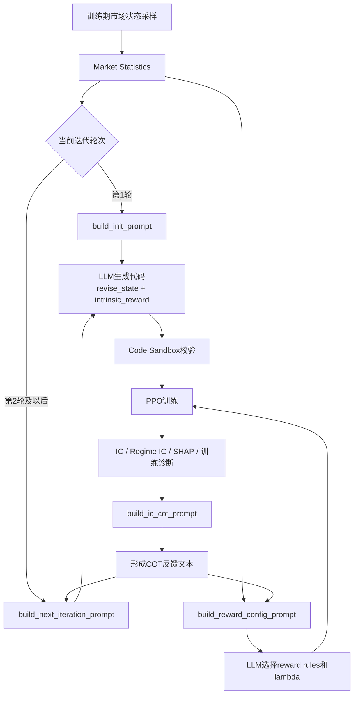
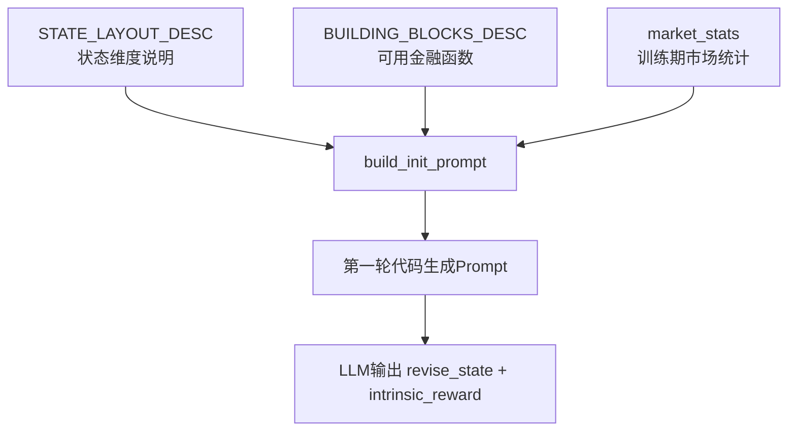
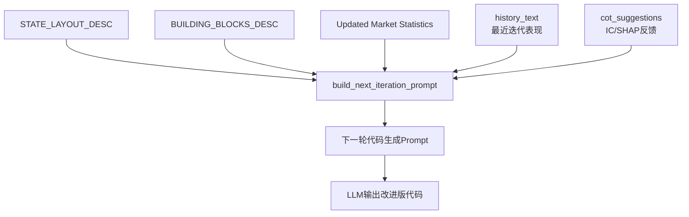
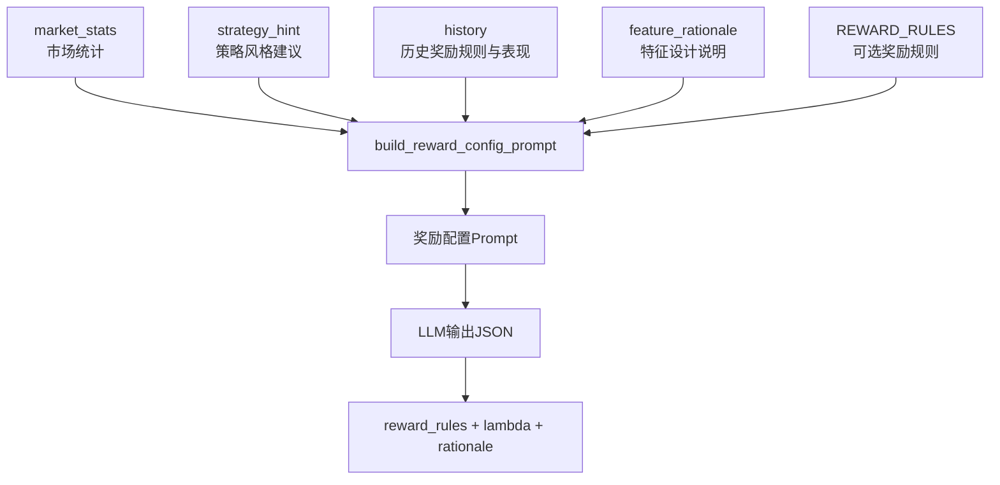
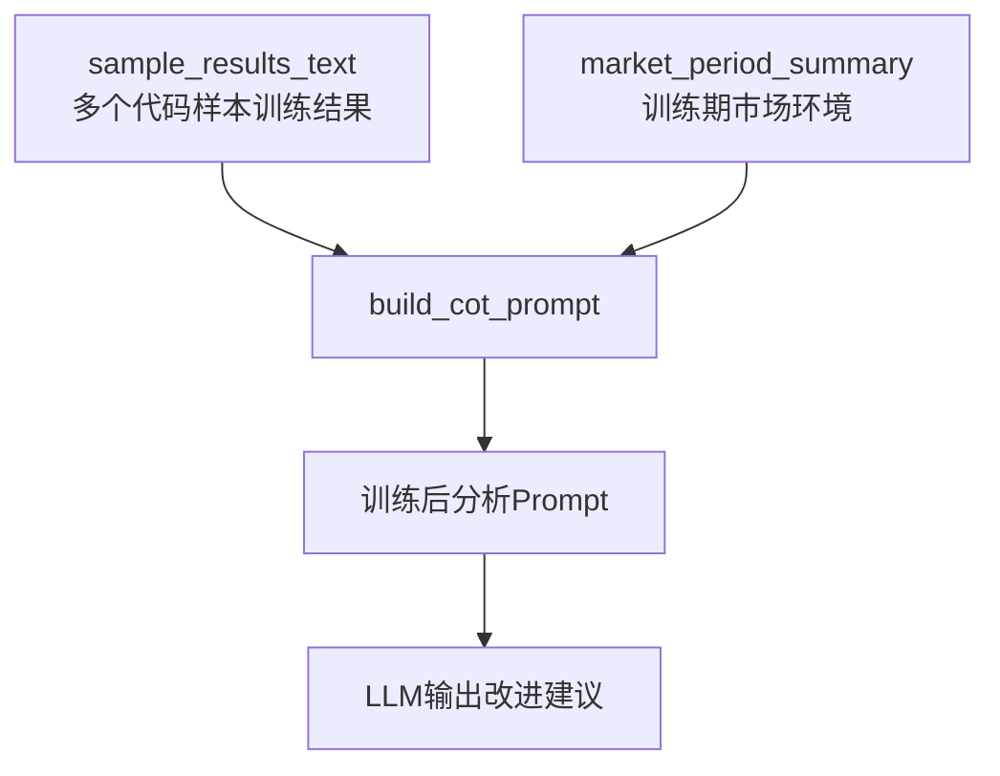
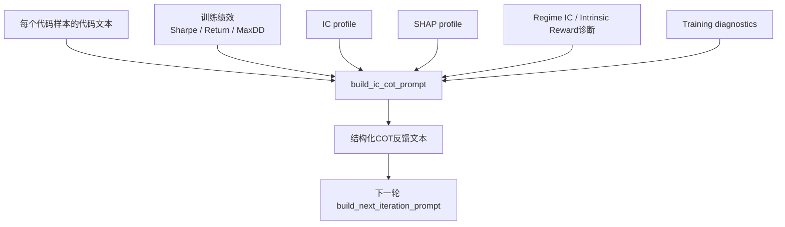
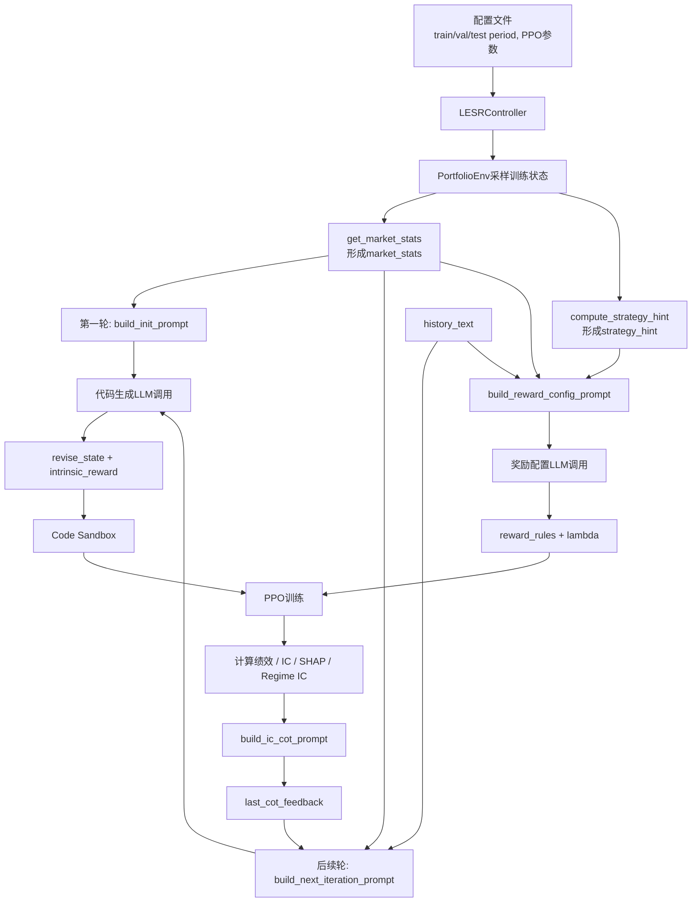

# LESR 系统迭代提示词模板梳理

本文档梳理当前 LESR 框架中用于系统迭代的提示词模板，包括模板原文、动态变量、形成逻辑和每类模板在迭代闭环中的作用。

提示词相关代码主要来自：

```text
core/prompts.py
core/ic_analyzer.py
core/lesr_controller.py
```

当前系统中的 LLM 不直接输出交易动作，而是参与三个环节：

```text
1. 生成状态增强代码 revise_state(s)
2. 生成内在奖励代码 intrinsic_reward(updated_s)
3. 选择和参数化额外奖励规则 reward_rules
```

此外，系统会把训练后的 IC、Regime IC、SHAP 和训练诊断结果组织成反馈文本，注入下一轮代码生成 prompt，从而形成闭环迭代。

---

## 1. 提示词在系统迭代中的位置



### 解释

系统中的提示词不是孤立的一次性输入，而是随着训练迭代不断更新。

第一轮没有历史经验，因此使用 `build_init_prompt`。它主要告诉 LLM：当前任务是什么、原始状态维度如何排列、可以调用哪些金融特征构造函数、输出代码格式是什么。

第二轮及以后使用 `build_next_iteration_prompt`。它在第一轮模板的基础上加入历史迭代表现和 COT 反馈，让 LLM 根据前几轮结果改进状态表示和内在奖励。

奖励规则由 `build_reward_config_prompt` 单独生成。它不要求 LLM 写 Python 代码，而是要求 LLM 输出 JSON，从预定义规则库中选择 2-4 个奖励规则并设置参数。

`build_ic_cot_prompt` 严格来说不是直接向 LLM 发起请求的 prompt 模板，而是系统根据训练结果自动构造的反馈文本。这个反馈文本会被插入下一轮 `build_next_iteration_prompt`，成为下一轮代码生成的重要依据。

---

## 2. 系统消息模板

LLM 调用入口在 `LESRController._call_llm()` 中。不同任务使用不同的 system message。

### 2.1 默认 JSON 系统消息

用于奖励规则配置等需要 JSON 输出的场景。

````text
You are a quantitative portfolio manager. Always respond with valid JSON.
````

### 解释

这个系统消息强调两个约束：

```text
1. LLM 的身份是 quantitative portfolio manager
2. 输出必须是 valid JSON
```

它主要服务于 `build_reward_config_prompt`，因为奖励规则配置需要被 `_extract_json()` 解析。

### 2.2 代码生成系统消息

用于 `revise_state` 和 `intrinsic_reward` 的代码生成。

````text
You are a quantitative portfolio manager. Write Python code for revise_state and intrinsic_reward functions.
````

### 解释

这个系统消息把 LLM 的任务从“解释问题”收束为“写可执行代码”。它与后续的 Code Sandbox 配合使用，要求 LLM 生成两个明确的函数：

```text
revise_state(s)
intrinsic_reward(updated_s)
```

---

## 3. 公共模板片段

以下片段会被多个 prompt 复用，是系统提示词的基础约束。

---

## 3.1 状态布局说明 STATE_LAYOUT_DESC

### 模板原文

````text
The current state for each stock is represented by a 120-dimensional Python NumPy array, denoted as `s`.

Details of each dimension in the state `s` are as follows:
- `s[0]` through `s[5]`: [close, open, high, low, volume, adjusted_close] for day 1
- `s[6]` through `s[11]`: same 6 channels for day 2
- ...
- `s[114]` through `s[119]`: same 6 channels for day 20

In other words:
- `s[0::6]` = close prices (20 values, oldest to newest)
- `s[1::6]` = open prices
- `s[2::6]` = high prices
- `s[3::6]` = low prices
- `s[4::6]` = volumes
- `s[5::6]` = adjusted close prices
````

### 解释说明

这个片段告诉 LLM 单只股票原始状态 `s` 的精确排列方式。它非常关键，因为 LLM 生成的 `revise_state(s)` 必须从 `s` 中正确抽取价格、成交量和收益率。

该说明同时隐含了代码生成约束：

```text
1. 输入是单只股票的 120 维 NumPy array
2. LLM 不能在 revise_state(s) 内直接访问其他股票
3. 如果要构造动量、波动率、成交量信号，必须从 s[0::6]、s[4::6] 等切片中提取
```

---

## 3.2 可用特征构造函数 BUILDING_BLOCKS_DESC

### 模板原文

````text
Available computation functions (import from feature_library):

1. compute_relative_momentum(prices, window=20)
   Input: prices = 1D array of close prices (length >= window)
   Output: scalar, this stock's excess return vs window-average
   Use case: identify relatively outperforming stocks

2. compute_realized_volatility(returns, window=20)
   Input: returns = 1D array of daily returns
   Output: scalar, realized volatility
   Use case: measure individual stock risk

3. compute_downside_risk(returns, window=20)
   Input: returns = 1D array of daily returns
   Output: scalar, downside semi-deviation
   Use case: measure downside risk

4. compute_multi_horizon_momentum(prices, windows=[5, 10, 20])
   Input: prices = 1D array of close prices
   Output: array of 3 scalars, momentum at each horizon
   Use case: capture trend at multiple time scales

5. compute_zscore_price(prices, window=20)
   Input: prices = 1D array
   Output: scalar, z-score of current price vs N-day mean
   Use case: mean reversion signal

6. compute_mean_reversion_signal(prices, window=20)
   Input: prices = 1D array
   Output: scalar, mean reversion strength
   Use case: identify overextended prices

7. compute_turnover_ratio(volumes, window=20)
   Input: volumes = 1D array
   Output: scalar, current volume / average volume
   Use case: liquidity detection

Note: compute_cross_sectional_rank and compute_beta are portfolio-level
functions — they require data from all stocks, not available inside revise_state(s).
They are computed at the environment level, not inside your code.
````

### 解释说明

这个片段相当于给 LLM 一个“安全特征工具箱”。它限制 LLM 优先使用项目中已经实现好的金融函数，而不是随意编写不可控复杂逻辑。

这里特别强调 `compute_cross_sectional_rank` 和 `compute_beta` 不能在 `revise_state(s)` 中使用，因为 `revise_state(s)` 只能看到单只股票的状态，不能看到全市场或全部股票。

这个约束可以减少两类错误：

```text
1. LLM 生成无法执行的跨股票代码
2. LLM 在单股函数中假设存在全局市场数据
```

---

## 3.3 奖励规则候选集 REWARD_RULES

### 模板原文

````text
penalize_concentration: Penalty when any stock weight exceeds max_weight. Default max_weight=0.35, penalty=0.1.
reward_diversification: Bonus when holding >= min_stocks above 5%. Default min_stocks=3, bonus=0.05.
penalize_turnover: Penalty when turnover > threshold. Default threshold=0.1, penalty=0.15.
regime_defensive: Bonus for holding cash when risk_level is high. Default crisis_threshold=0.6, cash_bonus=0.1.
momentum_alignment: Bonus when weights correlate with momentum rank. Default bonus=0.05.
volatility_scaling: Scale down reward in high-vol regime. Default vol_threshold=0.5, scale=0.5.
drawdown_penalty: Penalty when drawdown exceeds threshold. Default dd_threshold=0.1, penalty=0.15.
````

### 解释说明

奖励规则候选集用于 `build_reward_config_prompt`。LLM 不能任意创造奖励规则，只能从这些预定义规则中选择并参数化。

这样做的好处是：

```text
1. 保持奖励函数可控
2. 避免 LLM 输出无法接入环境的奖励形式
3. 让奖励塑形具备金融含义和可解释性
4. 便于不同迭代之间比较 reward rules 的变化
```

---

## 4. 第一轮代码生成模板 build_init_prompt

### 调用位置

```text
LESRController._generate_code(iteration=1)
```

第一轮迭代调用：

```python
prompt = build_init_prompt(market_stats)
```

### 模板形成逻辑



第一轮没有历史经验，因此模板重点提供：

```text
1. 任务定义：5只股票 + CASH 动态组合配置
2. 状态输入格式：120维单股状态
3. 可调用函数：feature_library 中的金融特征函数
4. 市场统计：当前训练期的收益、波动、风险等摘要
5. 输出要求：必须生成 revise_state 和 intrinsic_reward 两个函数
```

### 模板原文

````text
Revise the state representation for a reinforcement learning agent.
=========================================================
Task: Dynamic portfolio allocation across 5 stocks (TSLA, NFLX, AMZN, MSFT, JNJ)
      plus a CASH asset (6 assets total). The goal is to maximize risk-adjusted returns.
=========================================================

{STATE_LAYOUT_DESC}

You should design a task-related state representation based on the source 120 dim to better
for reinforcement training, using the detailed information mentioned above to do some calculations,
and feel free to do complex calculations, and then concat them to the source state.

{BUILDING_BLOCKS_DESC}

Market Statistics:
{market_stats}

Besides, we want you to design an intrinsic reward function based on the revise_state python function.

That is to say, we will:
1. use your revise_state python function to get an updated state: updated_s = revise_state(s)
2. use your intrinsic reward function to get an intrinsic reward: r = intrinsic_reward(updated_s)
3. to better design the intrinsic_reward, we recommend you use some source dim in the updated_s,
   which is between updated_s[0] and updated_s[119]
4. however, you must use the extra dim in your given revise_state python function,
   which is between updated_s[120] and the end of updated_s

IMPORTANT for intrinsic_reward design:
- The intrinsic_reward should help the RL agent learn BETTER states, not just amplify returns.
- If the Market Strategy Guidance above indicates high risk (Defensive/Crisis regime),
  your intrinsic_reward should penalize states with high volatility or downside risk.
  Example: reward = -alpha * max(0, extra_risk_feature - threshold)
- If the regime is favorable (Aggressive/Balanced), reward exploration of informative features.
- A good intrinsic_reward correlates with (but is not identical to) future portfolio performance.

Your task is to create two Python functions, named `revise_state`, which takes the current state `s`
as input and returns an updated state representation, and named `intrinsic_reward`, which takes the
updated state `updated_s` as input and returns an intrinsic reward. The functions should be executable
and ready for integration into a reinforcement learning environment.

The goal is to better for reinforcement training. Lets think step by step. Below is an illustrative
example of the expected output:

```python
import numpy as np
def revise_state(s):
    # Your state revision implementation goes here
    return updated_s
def intrinsic_reward(updated_s):
    # Your intrinsic reward code implementation goes here
    return intrinsic_reward
```
````

### 解释说明

这个模板承担“初始化搜索空间”的作用。它既告诉 LLM 可以如何理解金融状态，也明确要求 LLM 的输出必须是代码，而不是自然语言解释。

模板中特别强调：

```text
revise_state 必须把新增特征 concat 到原始状态后面
intrinsic_reward 必须使用新增特征维度 updated_s[120:]
intrinsic_reward 不能只是放大收益，而应帮助 PPO 学到更好的状态
```

这使得 LLM 生成结果能够被后续环境直接接入：

```text
raw_state s -> revise_state(s) -> updated_s
updated_s -> intrinsic_reward(updated_s)
```

---

## 5. 后续轮代码生成模板 build_next_iteration_prompt

### 调用位置

```text
LESRController._generate_code(iteration > 1)
```

第二轮及以后调用：

```python
history_text = self._format_history()
cot_suggestions = self.last_cot_feedback
prompt = build_next_iteration_prompt(market_stats, history_text, cot_suggestions)
```

### 模板形成逻辑



与第一轮相比，后续轮模板增加了两类动态信息：

```text
1. history_text
   最近若干轮的训练 Sharpe、Return、IC profile 等。

2. cot_suggestions
   由 build_ic_cot_prompt 生成的解释性反馈。
```

因此，后续轮不是从零生成，而是在历史结果和解释性分析的基础上继续改进。

### 模板原文

````text
Revise the state representation for a reinforcement learning agent.
=========================================================
Task: Dynamic portfolio allocation across 5 stocks (TSLA, NFLX, AMZN, MSFT, JNJ) + CASH.
=========================================================

{STATE_LAYOUT_DESC}

{BUILDING_BLOCKS_DESC}

Updated Market Statistics:
{market_stats}

For this problem, we have some history experience for you, here are some state revision codes
we have tried in the former iterations:
{history_text}

{cot_suggestions}

Based on the former suggestions. We are seeking an improved state revision code and an improved
intrinsic reward code that can enhance the model's performance on the task.

NOTE for intrinsic_reward: Follow the Market Strategy Guidance above. In high-risk regimes,
penalize volatile states; in favorable regimes, reward exploration of informative features.

Your task is to create two Python functions, named `revise_state`, which takes the current state `s`
as input and returns an updated state representation, and named `intrinsic_reward`, which takes the
updated state `updated_s` as input and returns an intrinsic reward. The functions should be executable
and ready for integration into a reinforcement learning environment.

The goal is to better for reinforcement training. Lets think step by step. Below is an illustrative
example of the expected output:

```python
import numpy as np
def revise_state(s):
    return updated_s
def intrinsic_reward(updated_s):
    return float_reward
```
````

### 解释说明

这个模板是 LESR 闭环迭代的核心。它让 LLM 不再只是根据市场统计随机生成技术指标，而是根据前一轮训练结果进行针对性修改。

其中 `history_text` 由 `_format_history()` 生成，通常包括：

```text
Iteration t:
  Train Sharpe
  Return
  IC profile
```

`cot_suggestions` 则包含更细粒度的解释性诊断，例如：

```text
哪些特征 IC 强
哪些特征 IC 弱
哪些特征在 volatile regime 下失效
哪些特征被 Critic 使用但没有预测能力
哪些特征有预测能力但没有被 Critic 使用
intrinsic_reward 与表现的相关性如何
```

因此，后续轮 prompt 的本质是：

```text
基础任务说明 + 当前市场信息 + 历史表现 + 可解释性反馈 -> 改进代码生成
```

---

## 6. 奖励规则配置模板 build_reward_config_prompt

### 调用位置

```text
LESRController._configure_rewards()
```

每轮迭代都会调用：

```python
prompt = build_reward_config_prompt(
    market_stats=market_stats,
    iteration=iteration,
    history=self.iteration_history,
    feature_rationale=feature_rationale,
    strategy_hint=strategy_hint,
)
```

### 模板形成逻辑



奖励规则模板与代码生成模板不同。它不要求 LLM 写 Python 函数，而是要求输出 JSON。

输出 JSON 会被 `_extract_json()` 解析，然后根据 `REWARD_RULE_REGISTRY` 构造实际奖励函数。

### 模板原文

````text
You are configuring the reward function for a PPO-based portfolio optimizer.

The base reward is Mean-Variance: r = portfolio_return - lambda * drawdown^2
Plus an intrinsic reward designed by another LLM code.

Your task: Select and parameterize additional reward rules to guide the agent.

## Market Statistics
{market_stats}

{strategy_section}

{history_section}

## Selected Features Rationale
{feature_rationale}

## Available Reward Rules
{rules_cat}

## Your Task
Select 2-4 reward rules and set their parameters. Consider:
1. Current market conditions and the strategy guidance above
2. Common failure modes (concentration, excessive turnover, ignoring regime)
3. Complementarity between rules (avoid redundant penalties)
4. In high-risk regimes, use MORE conservative lambda (0.6-1.0) and defensive rules

## Output Format (JSON only)
```json
{
  "reward_rules": [
    {"rule": "penalize_concentration", "params": {"max_weight": 0.35}},
    {"rule": "regime_defensive", "params": {"crisis_threshold": 0.6}}
  ],
  "lambda": 0.5,
  "rationale": "Brief explanation of why these rules were selected"
}
```

Rules:
- Select 2-4 reward rules
- lambda controls risk aversion in base reward (0.1=aggressive, 1.0=conservative)
- In Crisis/Defensive regime, prefer lambda >= 0.6
- Use default params unless market conditions suggest otherwise
````

### strategy_section 原文

当存在 `strategy_hint` 时，会插入以下片段：

````text
## Market Strategy Guidance (for reward rule selection)
{strategy_hint}

IMPORTANT: Select reward rules that align with the market regime above.
- In Crisis/Defensive regime: prioritize regime_defensive, volatility_scaling, drawdown_penalty
- In Balanced regime: use a mix of concentration and turnover rules
- In Aggressive regime: focus on concentration and diversification rules
````

### history_section 形成逻辑

当存在历史迭代结果时，会插入最近若干轮结果：

````text
## Previous Iteration Results
### Iteration {iteration}
- Reward rules used: {reward_rules}
- Sharpe: {sharpe}
- Max Drawdown: {max_drawdown}%
- Turnover: {turnover}
````

### 解释说明

这个模板用于让 LLM 根据当前市场环境选择风险塑形方式。

例如：

```text
如果市场处于高风险或高波动状态：
  更倾向选择 regime_defensive、volatility_scaling、drawdown_penalty
  lambda 应该更保守，例如 0.6-1.0

如果市场较平稳：
  可以使用 concentration、turnover、diversification 等规则

如果策略过度集中：
  使用 penalize_concentration

如果策略交易过于频繁：
  使用 penalize_turnover
```

奖励规则 prompt 的输出会影响环境中的最终奖励：

```text
reward = base_reward + rule_bonus + intrinsic_reward
```

---

## 7. 训练后 COT 分析模板 build_cot_prompt

### 调用位置

当前 `lesr_controller.py` 中主要使用的是 `build_ic_cot_prompt` 生成反馈文本，并将其直接插入下一轮 `build_next_iteration_prompt`。`build_cot_prompt` 是一个更通用的训练后分析 prompt 模板，代码中保留但当前主流程没有直接调用它向 LLM 请求单独分析。

### 模板形成逻辑



### 模板原文

````text
We have successfully trained Reinforcement Learning (RL) policy using different
state revision codes and intrinsic reward function codes sampled by you, and each pair of code
is associated with the training of a policy relatively.

Throughout every state revision code's training process, we monitored:
1. The final policy performance (accumulated reward).
2. Most importantly, every state revise dim's Information Coefficient (IC) with forward returns.
   The IC measures how predictive each state dimension is for future portfolio returns.
   Higher |IC| means the dimension is more useful for the RL agent's decision making.
3. Market environment context and regime-specific IC analysis.

Here are the results:
{sample_results_text}

[Market Environment During Training]
{market_period_summary}

You should analyze the results mentioned above and give suggestions about how to improve the
performance of the "state revision code".

Here are some tips for how to analyze the results:
(a) if you find a state revision code's performance is very low, then you should analyze to
    figure out why it fails
(b) if you find some dims' IC are more related to the final performance, you should analyze
    to figure out what makes it successful
(c) pay attention to regime-specific IC - features that work in trending markets may fail in
    volatile markets
(d) analyze how to improve both the "state revision code" and "intrinsic reward code"
(e) if the Risk Feature Gap Analysis shows features failing in volatile regime, you MUST
    add defensive features (realized_volatility, downside_risk, or zscore_price)
(f) adjust intrinsic_reward to penalize high-risk states when market conditions are unfavorable

Lets think step by step. Your solution should aim to improve the overall performance of the RL policy.
````

### 解释说明

这个模板的作用是让 LLM 对训练结果进行分析，而不是直接生成下一轮代码。

它关注三个问题：

```text
1. 哪些代码样本表现好，哪些表现差
2. 哪些状态维度的 IC 更强
3. 哪些特征在不同 market regime 下存在稳定性问题
```

在当前主流程中，这类分析逻辑被更工程化的 `build_ic_cot_prompt` 替代。也就是说，系统直接根据 IC、SHAP 和 regime IC 自动生成结构化反馈，而不是额外调用 LLM 先写一段分析。

---

## 8. IC + SHAP 反馈文本 build_ic_cot_prompt

### 调用位置

```text
LESRController.run()
```

每轮代码样本训练结束后调用：

```python
cot_text = build_ic_cot_prompt(
    sample_results,
    best_idx,
    market_period_summary=self._get_market_summary(),
    training_diagnostics=best_train_result.get("training_diagnostics", ""),
)
self.last_cot_feedback = cot_text
```

下一轮代码生成时：

```python
prompt = build_next_iteration_prompt(market_stats, history_text, self.last_cot_feedback)
```

因此，`build_ic_cot_prompt` 的输出会直接成为下一轮 prompt 的一部分。

### 形成逻辑



### 输出文本结构原文

`build_ic_cot_prompt` 不是固定的一整个 f-string，而是逐行拼接生成。其主要输出结构如下：

````text
========== Code Sample {i+1}{marker} (Sharpe={sharpe}, Return={total_return}%, MaxDD={max_drawdown}%) ==========
{code}

[Feature Analysis: IC + Critic SHAP]
  IC = correlation with forward returns (predictive power)
  SHAP = how much the RL critic relies on this feature
  (High SHAP + High |IC| = ideal feature)

  s[{dim}]: IC={ic_val} SHAP={shap_val} {tag}

[IC Analysis]
  s[{dim}]: IC = {ic_val} <- {tag}

[Regime-Specific IC]
  {regime}:
    s[{dim}]: IC = {ic_val}

[Intrinsic Reward Diagnosis]
  Mean intrinsic_reward = {mean}
  Correlation with performance = {correlation_with_performance}
  -> Strong guidance effect / Moderate guidance effect / Weak guidance effect

[Training Process Diagnostics]
{training_diagnostics}

[Improvement Suggestions]
  (a) Most valuable feature: s[{d}] (IC={ic_v}, SHAP={sh_v}).
      The critic relies on it and it predicts returns.
      Consider building derivatives or multi-horizon versions.

  (b) Misused features (high SHAP, low IC): {dim_str}.
      The policy relies on these but they don't predict returns.
      This is a sign of overfitting. Consider removing them.

  (c) Underused features (high IC, low SHAP): {dim_str}.
      These predict returns but the policy ignores them.
      Try making them more prominent or combining with existing features.

  (d) Negative IC features: {dim_str}.
      These may be harmful. Consider removing or inverting the signal.

  (e) No features show meaningful IC in volatile regime.
      Consider adding realized_volatility or downside_risk.

[Risk Feature Gap Analysis]
  Features that FAIL under volatile market conditions:
    s[{dim}]: overall IC={overall}, volatile-regime IC={vol}
  These features lose predictive power during market stress.
  Consider adding: realized_volatility, downside_risk, or zscore_price
  as a defensive complement to protect against regime shifts.

[Risk Feature Gap Analysis]
  WARNING: No features show meaningful IC in volatile regime!
  The current feature set is blind to market stress.
  STRONGLY recommend adding: downside_risk or realized_volatility
  and redesigning intrinsic_reward to penalize high-volatility states.
````

### 标签规则

`build_ic_cot_prompt` 会根据 IC 的绝对值给特征打标签：

```text
abs(IC) > 0.05  -> Strong
abs(IC) < 0.02  -> Weak
IC < -0.03      -> Negative
```

如果存在 SHAP，则系统进一步分析：

```text
High SHAP + High |IC|:
  理想特征，说明该特征既有预测能力，又被 Critic 实际使用。

High SHAP + Low |IC|:
  被误用的特征，可能表示策略过拟合。

Low SHAP + High |IC|:
  未被充分利用的特征，应考虑增强其表达或与其他特征组合。
```

### 解释说明

这个反馈模板是 LESR 相比普通 LLM 生成代码流程的关键。它把训练后的数值结果转化成下一轮 LLM 可以理解的自然语言建议。

其逻辑可以概括为：

```text
IC 判断特征是否有预测能力
SHAP 判断策略网络是否真的使用该特征
Regime IC 判断特征是否在不同市场环境中稳定
Intrinsic Reward Diagnosis 判断内在奖励是否对训练有指导作用
Training Diagnostics 判断 PPO 训练过程是否稳定
```

这些反馈共同推动下一轮 `revise_state` 和 `intrinsic_reward` 的改进。

---

## 9. 历史迭代文本 _format_history

### 调用位置

```text
LESRController._generate_code(iteration > 1)
```

### 形成逻辑

`_format_history()` 会读取最近 3 轮迭代记录，并格式化为文本，注入 `build_next_iteration_prompt`。

### 输出格式

````text
Iteration {iteration}:
  Train Sharpe: {sharpe}
  Return: {total_return}%
  IC profile: {ic_profile}
````

### 解释说明

历史文本提供的是低维摘要，主要告诉 LLM：

```text
1. 最近几轮整体表现如何
2. 哪一轮 Sharpe 更高
3. 当前生成特征的 IC profile 大致如何
```

它与 `build_ic_cot_prompt` 的区别是：

```text
_format_history:
  简短、指标级、用于概览历史迭代。

build_ic_cot_prompt:
  详细、解释性、用于指出具体特征应该如何修改。
```

---

## 10. 提示词闭环的整体形成逻辑



### 解释说明

整个提示词系统有两个并行但相互影响的生成方向：

```text
方向1：代码生成
  目标是生成 revise_state 和 intrinsic_reward。
  第1轮依赖任务说明和市场统计。
  后续轮依赖历史表现和解释性反馈。

方向2：奖励配置
  目标是选择 reward rules 和 lambda。
  每轮都根据市场统计、策略提示和历史表现重新配置。
```

两者最终都会进入 `PortfolioEnv`：

```text
revise_state -> 改变 PPO 状态空间
intrinsic_reward -> 增加内在奖励
reward_rules + lambda -> 改变外部奖励塑形
```

训练结束后产生的新反馈又会影响下一轮提示词，因此形成完整闭环：

```text
Prompt -> Code/Reward -> PPO Training -> Explanation -> Next Prompt
```

---

## 11. 各模板功能对照表

| 模板 | 触发时机 | 输入信息 | 输出目标 | 是否直接调用LLM |
|---|---|---|---|---|
| `build_init_prompt` | 第1轮代码生成 | 状态布局、工具函数、市场统计 | `revise_state` 和 `intrinsic_reward` 代码 | 是 |
| `build_next_iteration_prompt` | 第2轮及以后代码生成 | 市场统计、历史结果、COT反馈 | 改进版代码 | 是 |
| `build_reward_config_prompt` | 每轮奖励配置 | 市场统计、策略提示、历史结果、奖励规则库 | JSON奖励配置 | 是 |
| `build_cot_prompt` | 训练后分析备用模板 | 样本结果、市场环境 | LLM分析建议 | 当前主流程未直接使用 |
| `build_ic_cot_prompt` | 每轮训练后 | 代码、绩效、IC、SHAP、Regime IC、训练诊断 | 结构化反馈文本 | 否，作为下一轮prompt片段 |
| `_format_history` | 后续轮代码生成前 | 最近迭代记录 | 历史摘要文本 | 否，作为下一轮prompt片段 |

---

## 12. 论文/汇报中的表述建议

可以将当前提示词系统概括为：

```text
The prompting system consists of two coupled prompt streams:
(1) a code-generation stream for state representation and intrinsic reward design,
and (2) a reward-configuration stream for rule-based reward shaping.
After each PPO training round, IC, regime-specific IC, critic SHAP, and training diagnostics
are converted into structured feedback and injected into the next code-generation prompt.
This forms a closed-loop prompt optimization process.
```

中文表述可以写为：

```text
本框架中的提示词系统由两条相互耦合的生成链路组成：
一条负责生成状态增强函数和内在奖励函数，另一条负责配置奖励塑形规则。
每轮 PPO 训练完成后，系统将 IC、Regime IC、Critic SHAP 和训练诊断结果
转化为结构化反馈，并注入下一轮代码生成提示词，从而形成
“提示词生成 - 策略训练 - 可解释性反馈 - 提示词更新”的闭环优化机制。
```
