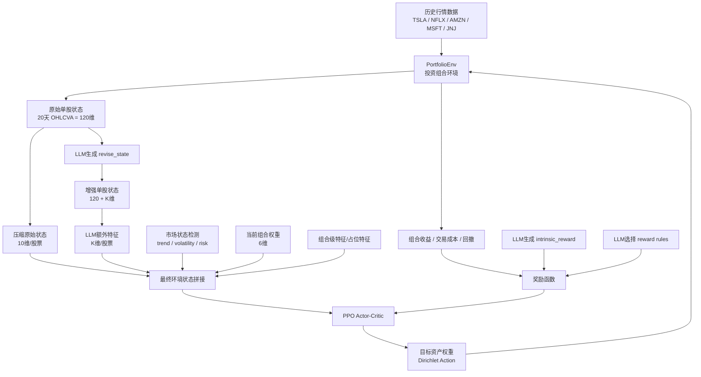
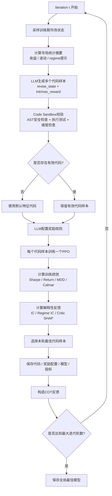
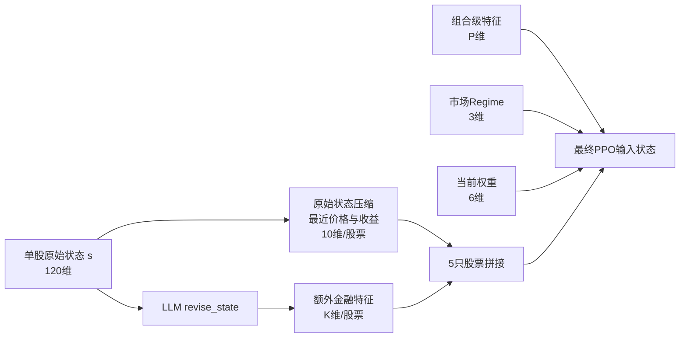
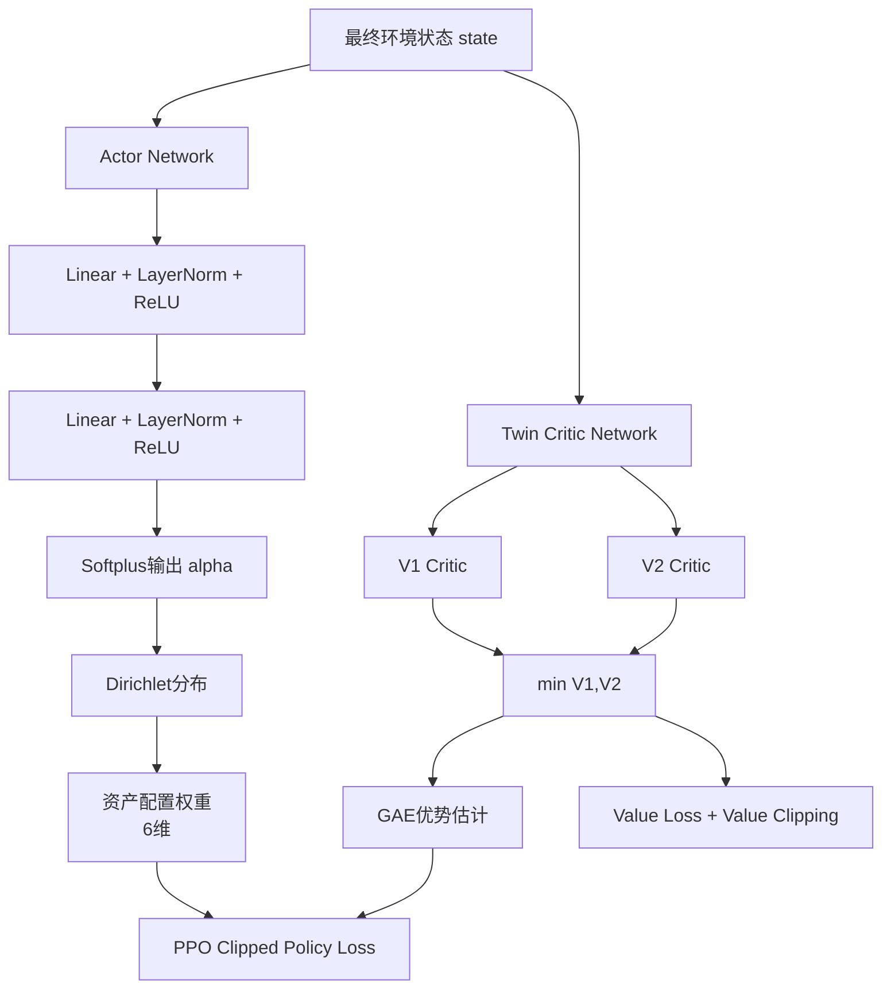
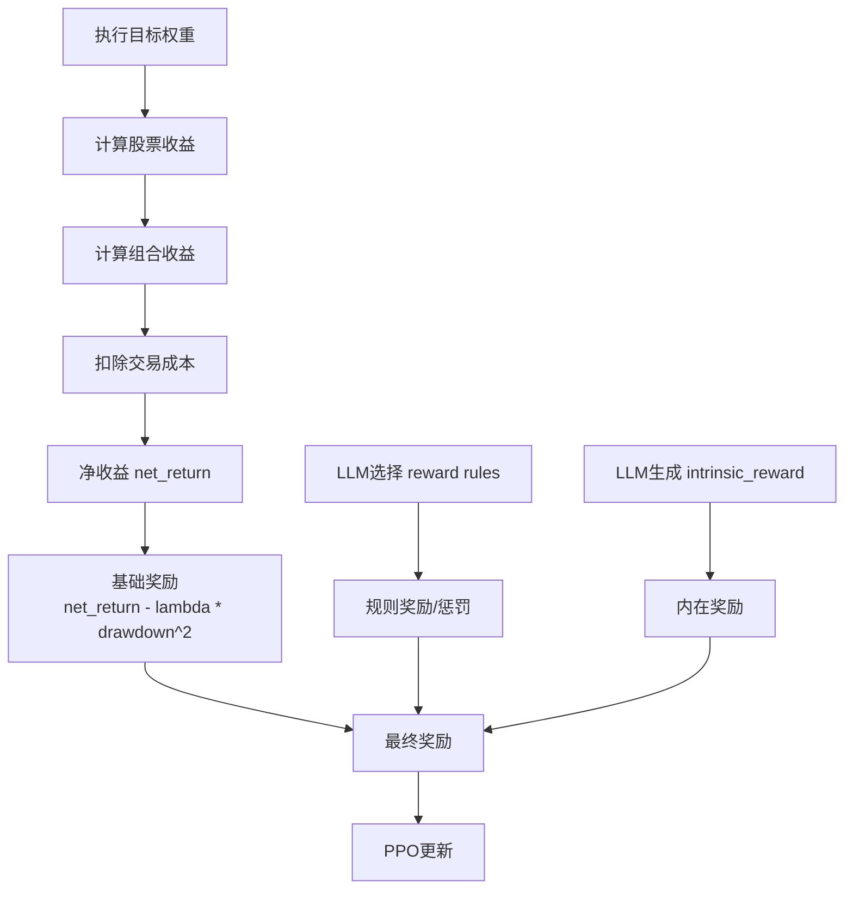
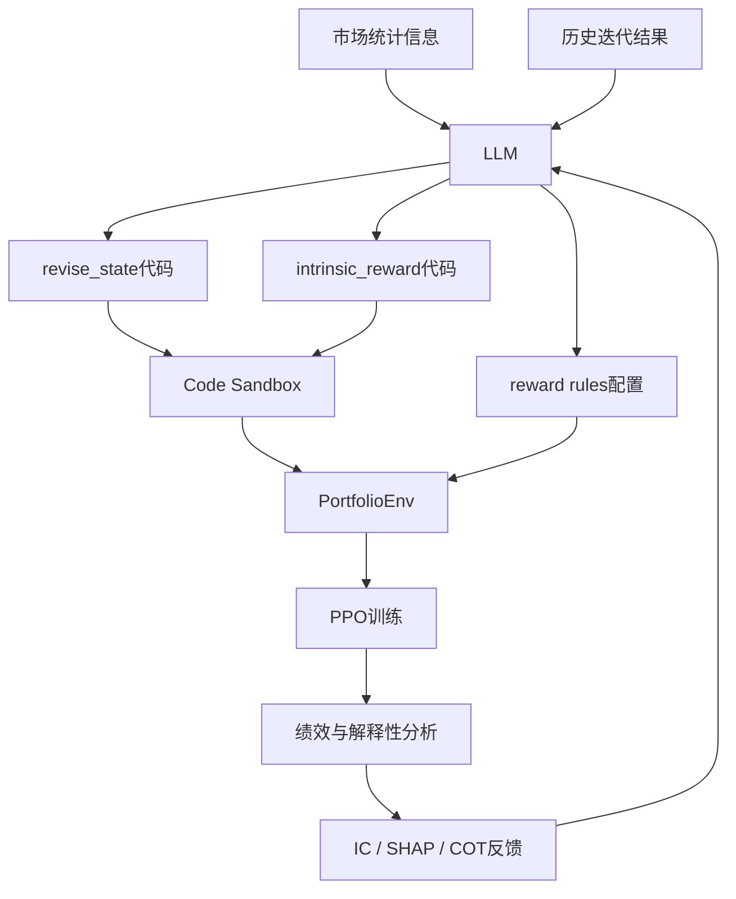
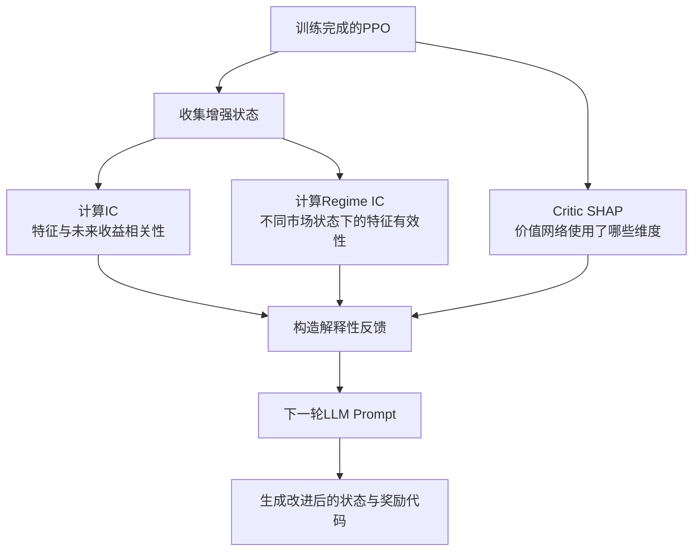
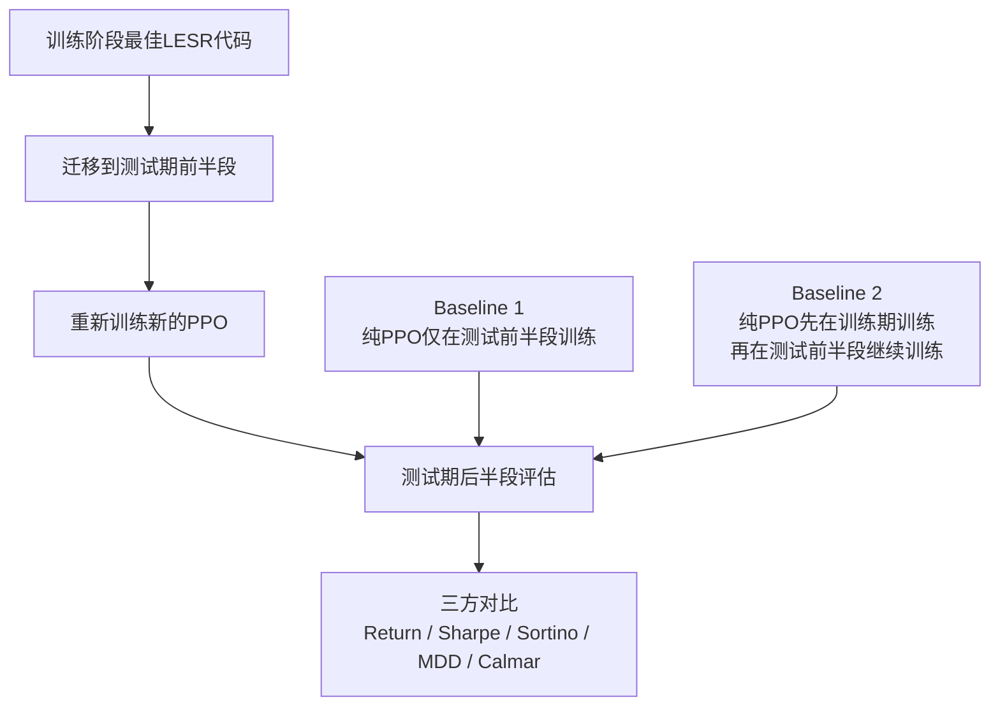
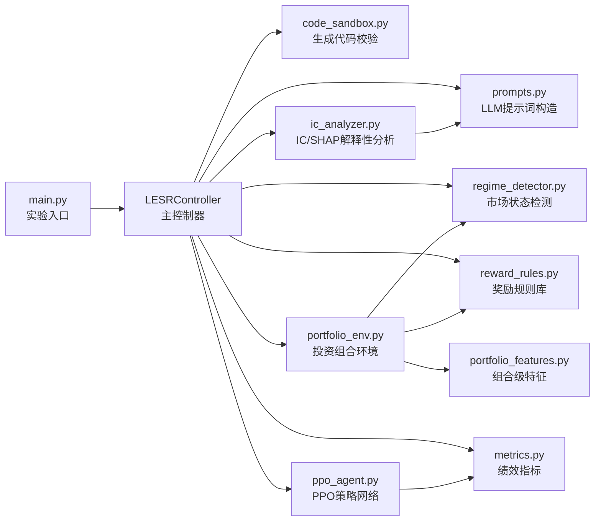

# LESR 模型框架梳理

本文档用于梳理当前项目中的模型框架。整体来看，本框架不是单纯的 PPO 投资组合优化模型，而是一个 **LLM-Empowered State Representation for Reinforcement Learning, LESR** 框架：LLM 负责设计状态增强函数、内在奖励函数和奖励规则配置，PPO 负责在增强后的状态空间中学习动态资产配置策略。

当前任务是 5 只股票加现金资产的动态组合优化：

```text
资产空间 = [TSLA, NFLX, AMZN, MSFT, JNJ, CASH]
动作空间 = 6 维目标权重
目标 = 在控制风险和交易成本的前提下提升风险调整后收益
```

---

## 1. 总体模型框架



### 解释

整个框架可以分成三层：

第一层是 **市场环境层**。`PortfolioEnv` 读取历史行情数据，构造单股原始状态、计算组合收益、交易成本、回撤，并维护当前组合权重。

第二层是 **LESR 状态增强层**。LLM 不直接输出交易动作，而是生成 `revise_state(s)` 函数，用来从 120 维原始单股状态中提取额外金融特征，例如动量、波动率、下行风险、均值回归信号等。这样，PPO 看到的状态不再只是原始行情压缩结果，而是带有任务相关金融归纳偏置的增强状态。

第三层是 **PPO 策略学习层**。PPO 接收拼接后的环境状态，输出 6 维资产权重。Actor 使用 Dirichlet 分布保证权重非负且和为 1，Critic 评估当前状态价值，并通过 PPO clipped objective 和 GAE 完成策略更新。

该框架的核心思想是：**LLM 负责设计更适合强化学习的状态表示和奖励塑形，PPO 负责最终的策略优化。**

---

## 2. LESR 迭代训练流程



### 解释

LESR 的训练过程是一个闭环优化过程。每一轮迭代中，LLM 会基于当前市场统计信息和历史反馈生成多个候选状态增强代码。每个代码样本都会经过沙箱校验，只有通过校验的代码才会被接入环境训练 PPO。

训练完成后，系统不会只看最终收益，而是同时计算多种反馈：

```text
Sharpe / Return / Max Drawdown：衡量策略绩效
IC：衡量新增特征与未来收益之间的相关性
Regime IC：衡量特征在不同市场状态下是否稳定有效
Critic SHAP：分析 PPO 的价值网络实际依赖了哪些状态维度
```

这些反馈会被重新组织为下一轮 LLM 的提示信息，使 LLM 在后续迭代中倾向于保留有效特征、修正无效特征，并调整内在奖励设计。

因此，LESR 的关键不只是“调用 LLM 生成代码”，而是形成了一个 **生成 - 训练 - 解释 - 反馈 - 再生成** 的闭环。

---

## 3. 状态表示结构



### 原始状态

每只股票的原始状态是 120 维，由过去 20 个交易日的 6 个行情通道交错排列构成：

```text
s[0:6]     = 第1天 [close, open, high, low, volume, adjusted_close]
s[6:12]    = 第2天 [close, open, high, low, volume, adjusted_close]
...
s[114:120] = 第20天 [close, open, high, low, volume, adjusted_close]
```

也可以按通道读取：

```text
s[0::6] = close prices
s[1::6] = open prices
s[2::6] = high prices
s[3::6] = low prices
s[4::6] = volumes
s[5::6] = adjusted close prices
```

### PPO最终输入

环境真正输入 PPO 的状态不是单股 120 维原始状态，而是经过拼接后的组合状态：

```text
state =
  [压缩原始特征: 10 * 5]
+ [LLM额外特征: K * 5]
+ [组合级特征: P]
+ [市场regime: 3]
+ [当前权重: 6]
```

其中，`K` 由 LLM 生成的 `revise_state` 函数决定。例如，如果 LLM 为每只股票额外构造 9 个特征，则额外状态维度是：

```text
9 * 5 = 45
```

### 解释

状态设计是本框架最重要的部分之一。传统 PPO 只能直接从原始价格序列中学习，而金融市场数据噪声大、样本少、非平稳性强，直接学习往往效率低。LESR 通过 LLM 生成技术指标和风险特征，相当于给 PPO 提供了更强的金融先验。

这种设计的好处是：

```text
1. 降低 PPO 从原始行情中学习复杂金融结构的难度
2. 将动量、波动、下行风险等可解释信号显式注入状态
3. 允许后续通过 IC 和 SHAP 分析新增特征是否真的有用
```

---

## 4. PPO 策略网络结构



### Actor

Actor 网络输入当前状态，输出 Dirichlet 分布的浓度参数 `alpha`：

```text
state -> MLP -> alpha
weights ~ Dirichlet(alpha)
```

使用 Dirichlet 分布有一个很适合组合优化的性质：

```text
weight_i >= 0
sum_i weight_i = 1
```

因此，Actor 输出天然就是合法的投资组合权重，不需要额外做 softmax 后再修正约束。

### Critic

当前实现默认使用 Twin Critic，即两个独立的 V 网络：

```text
V1(s), V2(s)
```

在估计优势函数时使用更保守的：

```text
V(s) = min(V1(s), V2(s))
```

这样做借鉴了 TD3 中 clipped double Q 的思想，可以降低价值函数过估计风险，使 PPO 在噪声较大的金融任务中更稳定。

### PPO 更新

训练过程中使用：

```text
GAE 计算优势函数
PPO clipped objective 更新 Actor
MSE value loss 更新 Critic
value clipping 稳定价值函数
entropy bonus 保持探索
gradient clipping 防止梯度爆炸
```

---

## 5. 奖励函数结构



当前奖励函数可以概括为：

```text
reward = base_reward + rule_bonus + intrinsic_reward
```

其中：

```text
base_reward = net_return - lambda * drawdown^2
net_return = portfolio_return - transaction_cost
```

### 基础奖励

基础奖励鼓励组合获得正收益，同时惩罚回撤：

```text
net_return 越高，奖励越高
drawdown 越大，惩罚越强
lambda 控制风险厌恶程度
```

如果 `lambda` 较大，策略会更加保守；如果 `lambda` 较小，策略会更偏向追求收益。

### 规则奖励

LLM 会从预定义的奖励规则库中选择若干条规则，包括：

```text
penalize_concentration：惩罚单只股票权重过高
reward_diversification：奖励分散持仓
penalize_turnover：惩罚过度换手
regime_defensive：高风险市场下奖励持有现金
momentum_alignment：奖励权重与动量排名一致
volatility_scaling：高波动环境下降低激进奖励
drawdown_penalty：回撤过大时额外惩罚
```

这些规则本质上是对 PPO 的行为进行塑形，避免策略只追求短期收益而忽略风险、换手成本或极端行情。

### 内在奖励

`intrinsic_reward` 由 LLM 生成，输入是增强后的状态 `updated_s`。它的作用不是直接替代收益奖励，而是鼓励 PPO 关注更有学习价值的状态特征。

例如，如果 LLM 认为当前市场风险较高，内在奖励可以惩罚高波动和高下行风险状态；如果市场较稳定，则可以鼓励动量或趋势信号。

---

## 6. LLM 在框架中的作用



### 解释

LLM 在当前框架中的定位非常清晰：它不是策略执行器，而是策略学习过程的辅助设计器。

具体来说，LLM 承担三个角色：

```text
1. 状态表示设计器
   生成 revise_state，将原始行情转化为更适合 PPO 学习的特征。

2. 内在奖励设计器
   生成 intrinsic_reward，引导 PPO 更关注有价值或更稳健的状态。

3. 奖励规则配置器
   根据市场环境选择风险控制、分散化、换手惩罚等规则。
```

这种设计避免了让 LLM 直接预测买卖信号。LLM 的输出被限制在“特征函数”和“奖励设计”层面，并且必须经过代码沙箱验证，降低了不可控风险。

---

## 7. 解释性反馈机制



### IC 反馈

IC 用于衡量每个新增状态维度与未来收益之间的相关性：

```text
IC > 0：该特征越高，未来收益倾向越高
IC < 0：该特征越高，未来收益倾向越低
|IC| 越大：该特征预测信息越强
```

如果某些新增特征 IC 长期接近 0，说明这些特征对收益预测帮助有限，下一轮 LLM 应该减少或替换这类特征。

### Regime IC 反馈

金融市场具有明显的状态依赖性。同一个特征可能在趋势市场有效，在震荡市场无效。因此框架进一步计算不同市场 regime 下的 IC。

市场 regime 当前由三维向量描述：

```text
trend_direction：趋势方向，范围 [-1, 1]
volatility_level：波动水平，范围 [0, 1]
risk_level：风险水平，范围 [0, 1]
```

Regime IC 的作用是判断特征是否具备跨市场状态的稳定性。

### Critic SHAP 反馈

IC 衡量的是特征与未来收益的统计相关性，而 SHAP 更关注 PPO 的价值网络实际使用了哪些特征。如果某个特征 IC 很高但 SHAP 很低，说明它虽然有预测价值，但策略网络可能没有充分利用它。

因此，IC 和 SHAP 提供的是两个不同角度：

```text
IC：这个特征有没有预测信息？
SHAP：PPO 实际有没有用这个特征？
```

---

## 8. 最终迁移与基线对比



### 解释

最终评估阶段采用的是代码迁移，而不是直接迁移旧 PPO 权重。也就是说，LESR 学到的主要知识被认为体现在：

```text
1. revise_state 中的状态增强逻辑
2. intrinsic_reward 中的内在奖励逻辑
3. reward rules 中的奖励塑形配置
```

测试期会被拆成前半段和后半段：

```text
测试前半段：用迁移来的 LESR 代码重新训练一个新的 PPO
测试后半段：评估该 PPO 的真实表现
```

同时设置两个纯 PPO baseline：

```text
Baseline 1：纯 PPO 只在测试前半段训练，再评估后半段
Baseline 2：纯 PPO 先在训练期训练，再在测试前半段继续训练，最后评估后半段
```

这样的对比可以回答一个关键问题：

```text
LESR 学到的状态表示和奖励设计，是否比单纯延长 PPO 训练更有迁移价值？
```

---

## 9. 代码模块对应关系



### 核心文件说明

```text
main.py
  项目入口，读取配置文件，创建 LESRController 并启动实验。

core/lesr_controller.py
  总调度模块，负责 LLM 调用、代码生成、PPO训练、指标计算、结果保存和最终对比。

core/portfolio_env.py
  强化学习环境，负责状态构造、动作执行、组合收益计算和奖励计算。

core/ppo_agent.py
  PPO智能体，包括 Actor、Twin Critic、GAE 和 PPO 更新逻辑。

core/code_sandbox.py
  校验 LLM 生成代码，防止危险操作，并确保 revise_state / intrinsic_reward 可执行。

core/reward_rules.py
  预定义奖励规则库，由 LLM 选择和参数化。

core/regime_detector.py
  根据 5 只股票的等权组合计算市场 trend、volatility、risk。

core/ic_analyzer.py
  计算新增特征的 IC、regime IC 和 critic SHAP。

core/metrics.py
  计算 Sharpe、Sortino、Max Drawdown、Calmar 等绩效指标。
```

---

## 10. 框架贡献点总结

当前框架的核心贡献可以概括为三点：

### 1. LLM 辅助状态表示学习

传统强化学习直接从原始价格状态中学习策略，而 LESR 让 LLM 生成任务相关的金融特征，将金融先验注入状态空间。

```text
原始状态 -> LLM特征增强 -> 更适合PPO学习的状态表示
```

### 2. LLM 辅助奖励塑形

奖励函数不仅包含收益和回撤，还加入了 LLM 生成的内在奖励以及 LLM 选择的风险控制规则。

```text
收益奖励 + 风险惩罚 + 规则塑形 + 内在奖励
```

这使 PPO 不只是追求短期收益，也能被引导关注分散化、换手率、风险状态和下行风险。

### 3. 基于解释性指标的闭环迭代

框架引入 IC、Regime IC 和 Critic SHAP 作为反馈信号，使 LLM 的下一轮生成不是盲目采样，而是基于可解释性分析进行修正。

```text
生成代码 -> 训练PPO -> 解释特征有效性 -> 反馈给LLM -> 生成更优代码
```

因此，LESR 的本质是一个 **可解释反馈驱动的 LLM-RL 协同优化框架**。
